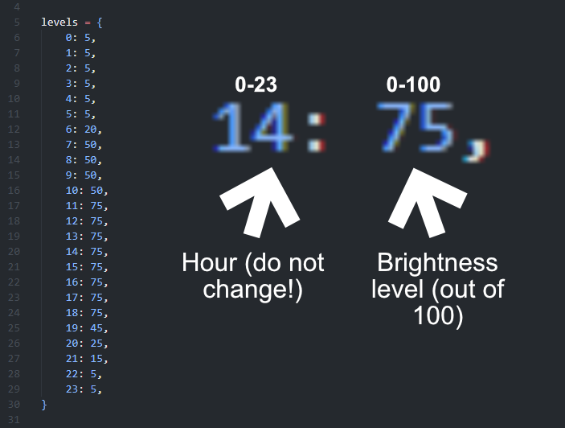

# Night Monitor
A python script that adjusts the brightness of your monitor(s) based on the time of day.

## Setting up
1. Make sure your monitor supports **"DDC/CI"** and that it's enabled!

2. Download/clone this repository using the green **"Code"**  button at the top-right of the repo and clicking **"Download ZIP"** or by doing 
    ```
    > git clone https://github.com/tripalc/night-monitor.git
    ```

3. Install python (if it's not already installed)! Go to: https://www.python.org/downloads/.  Or you can install it using a package manager, like apt, brew or winget.

4. Open **"main.py"** in your favourite text editor (e.g. VS Code or again, if your difficult, then vi.)

5. If you do **NOT** use windows, then delete lines 3, 38-44, and 51-57, or, in other words 

    ```
    from win10toast import ToastNotifier
    ```

    ```
    ToastNotifier().show_toast(
        "Brightness adjusted",
        f"Brightness set to {level}%",
        duration=0.01,
        threaded=True,
    )
    ```

    ```
    ToastNotifier().show_toast(
        "Brightness adjusted",
        f"Brightness set to {levels[datetime.now().hour]}%",
        duration=0.01,
        threaded=True,
    )
    ```

    All this does is get rid of the notification you get when running the script.

6. Set the levels! to do this, find the **"levels"** dictionary:
    
    ```
    levels = {
        0: 5, 1: 5, 2: 5, 3: 5, 4: 5, 5: 5,
        6: 20, 7: 50, 8: 50, 9: 50, 10: 50, 11: 75,
        12: 75, 13: 75, 14: 75, 15: 75, 16: 75, 17: 75,
        18: 75, 19: 45, 20: 25, 21: 15, 22: 5, 23: 5,
    }
    ```

    This is basically a schedule. On the left, you have the hour. And on the right, you have the brightness percentage. **For example, if you wanted your monitor to be at 25% at 6am, you would do: ```6: 25```.** If you wanted your monitor to be at 50% at 9pm, you would do ```21: 50```.

    

## Running the script
Here's a few ways on how to run the script:

- Either double-click the script or run it through the terminal using 
    ```
    > python main.py
    ```

- Windows: Create a shortcut of the script by doing:
    ```
    Right-click -> Show more options (Win11 only) -> Create shortcut
    ``` 
    and call it something like **"Night Monitor"** or something like that. You can give it an icon and then drag it onto your taskbar to pin it. Now, everytime you click the icon (or Win + Number in taskbar), your brightness will adjust.

- Also Windows: Keyboard shortcut. **Follow the previous steps except the taskbar (unless you want that)**
    1. Right-click the shortcut and click on "Properties".
    2. Then, go to the **"Shortcut"** tab and click **"Shortcut key"**. Hit a key combination (I have mine as Ctrl + Alt + B), and it'll be set.

**If you have an issue with anything please open an issue in the "Issues" tab above!**